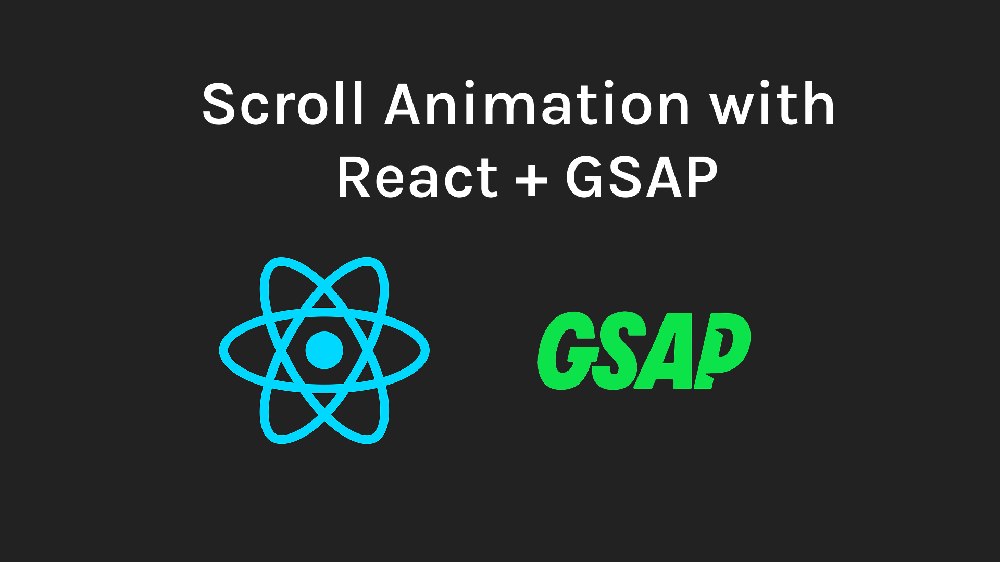

# Scroll-Triggered Animation with GSAP + React

This project demonstrates how to build smooth, scroll-triggered animations in a React application using **GSAP** and **ScrollTrigger**.

[](https://github.com/dmmuralitharan/react_gsap_layout_design_practice/raw/main/demo.mp4)

## 🛠 Tech Stack

- **React**
- **Tailwind CSS**
- **GSAP** (`gsap` + `ScrollTrigger`)

---

## 🔧 Getting Started

### 1. Clone the repository

```bash
git clone https://github.com/yourusername/your-repo.git
cd your-repo
```

### 2. Install dependencies

```bash
npm install
```

### 3. Start the development server
```bash
npm run dev
```

### 4. Open http://localhost:5173 in your browser

---
## 📎 Useful Links

- [GSAP Documentation](https://greensock.com/docs/)
- [ScrollTrigger Plugin](https://greensock.com/scrolltrigger/)

---

## 📬 Contact

📧 dmmuralitharan@gmail.com  
🔗 [LinkedIn](https://www.linkedin.com/in/dmmuralitharan)